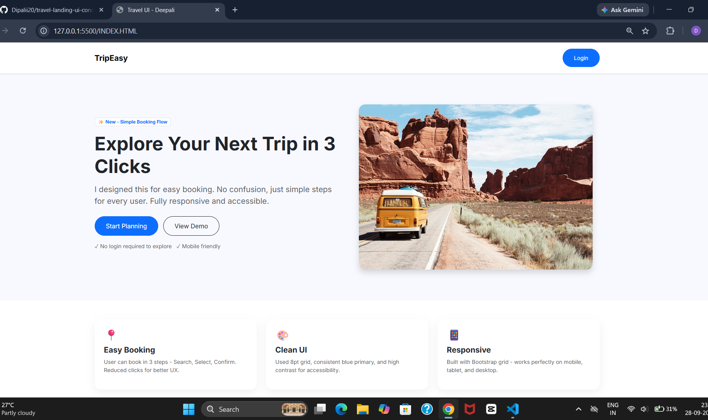

# ✈️ TripEasy – Travel Landing Page UI

A clean and responsive **Travel Booking Landing Page** built with **HTML, CSS, and Bootstrap 5**.  
The design focuses on simple navigation, a minimal booking flow, responsive layout, and a user-friendly interface.

## 📸 Preview




---

## ✨ Features

- 🎯 Simple and clean travel landing page
- 📍 Easy booking concept with a 3-step flow
- 🎨 Minimal and modern UI
- 📱 Fully responsive using Bootstrap Grid
- 🔐 Simple Login button
- 🖼️ Travel hero image
- ♿ High-contrast and accessibility-focused design
- 📐 Consistent spacing and 8pt-grid inspired layout

---

## 🛠️ Technologies Used

- **HTML5**
- **CSS3**
- **Bootstrap 5.3**
- **Google Fonts – Inter**
- **Unsplash** for the travel image

---

## 📂 Project Structure

```text
travel-landing-ui/
│
├── INDEX.HTML
├── style.css
└── assets/
    └── tripeasy-ui.png
```

---

## 🖥️ Main UI Sections

### 1. Navbar

The navigation bar contains:

- TripEasy brand name
- Login button
- Bootstrap responsive container
- Shadow for visual separation

### 2. Hero Section

The hero section contains:

- New feature badge
- Main travel heading
- Short description
- Start Planning button
- View Demo button
- Mobile-friendly information
- Travel image

### 3. Features Section

Three feature cards explain the main UX decisions:

| Feature | Description |
|---|---|
| 📍 Easy Booking | Booking flow designed around Search → Select → Confirm |
| 🎨 Clean UI | Consistent spacing, blue primary color, and readable contrast |
| 📱 Responsive | Bootstrap grid makes the page adaptable to different screen sizes |

---

## 🚀 How to Run

1. Clone or download the repository.

2. Open the project folder.

3. Make sure these files are present:

```text
INDEX.HTML
style.css
assets/tripeasy-ui.png
```

4. Open `INDEX.HTML` in a browser.

You can also use **VS Code + Live Server** for easier development.

---

## 🎯 UX Design Approach

The page was designed around a simple user journey:

```text
User
  ↓
Explore Trip
  ↓
Start Planning
  ↓
Search
  ↓
Select
  ↓
Confirm
```

The goal is to reduce unnecessary clicks and make the booking experience easy to understand.

---

## 📱 Responsive Design

Bootstrap's responsive grid is used to adapt the layout:

```text
Desktop
┌──────────────────────┬──────────────────────┐
│    Hero Content      │     Travel Image     │
└──────────────────────┴──────────────────────┘

Mobile
┌──────────────────────┐
│    Hero Content      │
├──────────────────────┤
│     Travel Image     │
└──────────────────────┘
```

---

## 👩‍💻 Author

**Deepali Chaudhari**

Computer Engineering Student | Java & Full Stack Development

---

⭐ If you like this project, feel free to explore the repository and give it a star!
